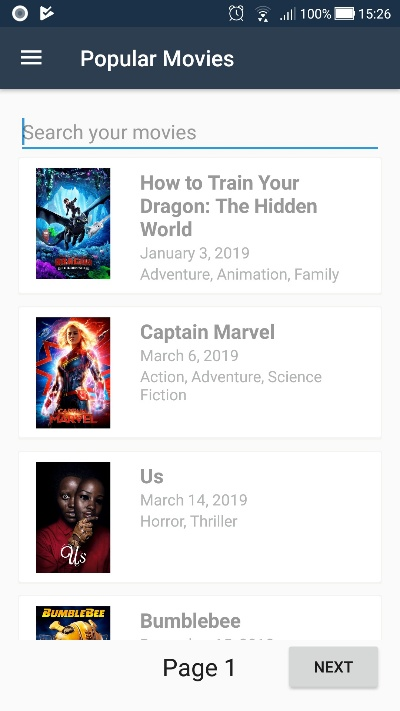

# Upcoming Movies App

* Application using Xamarin Android Platform
	 * Target Android version: 8.1 (API 27)
 	* Minimum Android version: 5.0 (API 21)

## Third part library

 * Newtonsoft.Json
	* Used to deserialize and serialize objects from Movie Database Api.
	* source: https://www.newtonsoft.com/json

 * Xam.Plugin.Connectivity
	* Used to verify connectivity internet.
	* source: https://github.com/jamesmontemagno/ConnectivityPlugin

* XamPicasso
	* Binding Library of Android Picasso used to download images form url.
	* source: https://github.com/square/picasso

## Screenshots

